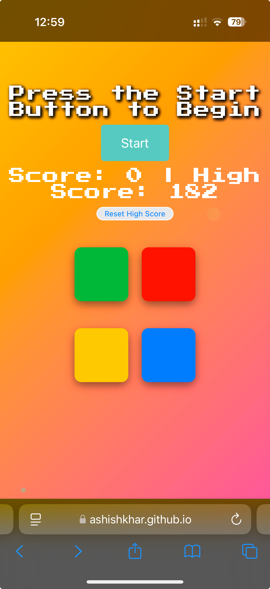

# Simon Game - Memory Challenge

<p align="center">
  
</p>
## 🎮 [Play the Game](https://ashishkhar.github.io/SIMON/)

A modern take on the classic Simon electronic memory game, built with JavaScript and jQuery. Test and improve your memory skills while having fun!

## 🌟 Features

- **Progressive Difficulty**: Game speed increases as you advance
- **Dynamic Shape-Shifting**: Buttons transform shapes at different levels
- **Score System**: 
  - Points awarded based on successful sequences
  - Streak multiplier system (up to 4x)
  - High score tracking with local storage
- **Achievement System**: Dynamic messages celebrate player milestones
- **Continuation System**: Option to continue after mistakes with score penalty
- **Responsive Design**: Works on both desktop and mobile devices

## 🎯 How to Play

1. Press the "Start" button to begin
2. Watch and memorize the sequence of colored buttons
3. Repeat the sequence by clicking the buttons in the correct order
4. Each successful round adds to your score and advances you to the next level
5. Make a mistake? Choose to continue with a score penalty or end the game

## 🏆 Scoring System

- Base points: 10 points per successful sequence
- Streak multiplier: Increases after every 3 perfect sequences
  - 1-3 sequences: 1x multiplier
  - 4-6 sequences: 2x multiplier
  - 7-9 sequences: 3x multiplier
  - 10+ sequences: 4x multiplier
- Penalties: 40% score reduction or minimum 20 points on mistakes

## 🎨 Special Features

### Dynamic Button Shapes
- Levels 1-3: Square buttons
- Level 4: Round buttons
- Level 5: Triangle appears
- Level 6: Pentagon appears
- Level 7+: Hexagon shapes

### Achievement Messages
- Level milestones
- Streak achievements
- High score celebrations

## 🛠️ Technologies Used

- HTML5
- CSS3
- JavaScript
- jQuery
- Local Storage API

## 🚀 Installation

1. Clone the repository:
```bash
git clone https://github.com/ashishkhar/SIMON.git
```
2. Open `index.html` in your web browser

## 💻 Development

To modify the game:

1. Edit `index.js` for game logic
2. Modify `styles.css` for visual changes
3. Update `index.html` for structure changes

## 🤝 Contributing

Contributions are welcome! Please feel free to submit a Pull Request.

1. Fork the repository
2. Create your feature branch (`git checkout -b feature/AmazingFeature`)
3. Commit your changes (`git commit -m 'Add some AmazingFeature'`)
4. Push to the branch (`git push origin feature/AmazingFeature`)
5. Open a Pull Request


## 👏 Acknowledgments

- Inspired by the classic Simon electronic game
- Sound effects from [Original Simon Game]
- Special thanks to the jQuery community

## 📧 Contact

Ashish Kharbanda - [GitHub](https://github.com/ashishkhar)

Project Link: [https://github.com/ashishkhar/SIMON](https://github.com/ashishkhar/SIMON)
